# Lab0: GitLab

## 实验任务

- 下载与安装 Git
- 学习基本的 Git & GitHub 操作

## 前言：浅谈版本控制（Version Control）

假设你正在用 C++ 实现一个简易的学生成绩管理系统：

```shell
StudentGradeManagementSystem/
├── main.cpp
├── include/
│   ├── student.h
│   └── grade.h
├── src/
│   ├── student.cpp
│   └── grade.cpp
├── tests
│   └── test.cpp
└── docs/
    └── README.md
```

某一天，你灵机一动：如果我用 `unordered_map` 代替 `vector` 组织学生列表，这样查找某个学生的时间复杂度就从 $O(n)$ 降到了 $O(1)$ ，于是你开心地将项目重构了一遍。过了几天，当你想要将学生按照成绩排序时，你觉得应该改回 `vector`，但之前的文件已经被覆盖了，你不得不再重写一遍。

或许有同学养成了代码备份的好习惯——将重构前的文件保存为 `student_old.h`、`student_old.cpp`等等。但当类似的情景再次发生时，你的项目结构将变得相当混乱。

另一种情景是，假设你和 Zecyel 同学在协作这个项目，你们同时修改了 `main.cpp`，合并的时候只能将代码逐行对比，将他的部分代码复制进来。

!!! tip

    你之前有过多人协同开发的经历吗？如果有，你们是使用什么方式分工协作的？在实验报告中描述一下。

### 什么是版本控制？

版本控制（Version Control）是一种用来记录文件内容的变化，并且能在以后回溯到特定版本的系统。

就像“保存历史记录”一样，它能帮我们：

- 保存每次修改（而不是只保留最新版本）
- 查看每次修改了什么
- 回退到任意一次修改
- 多人协作时合并修改

??? example "版本控制的实例"

    你可以查看我们课程网页仓库的 [commit 历史](https://github.com/ICS-26Fall-FDU/ICS-26Fall-FDU.github.io/commits/main/)，这里记录了我们的每一次修改。

    我们在生活中使用软件的版本号（例如 `v1.98.2`）则是“发行版”。

    例如我们使用的校园助手 App，在历经界面优化、接口修复等多次修改形成一个稳定、完整的版本后，才会打上标签（tag）发行。

## Git

Git 是一种分布式版本控制软件。

### 下载与安装

- [Windows](https://git-scm.com/downloads/win)
- [macOS](https://git-scm.com/downloads/mac)
- [Linux](https://git-scm.com/downloads/linux)

!!! note

    本学期的大部分实验都在 Linux 系统上完成，使用 Windows 系统的同学请在 WSL 或虚拟机安装 Git，使用服务器的同学请在服务器上安装 Git。

    检查安装是否成功。在虚拟机 / 服务器上输入 `git --version`，如果输出 `git version <版本号>`，则为安装成功。

### 配置

在 Git 中，`git config` 是用来配置 Git 行为和环境的命令。

!!! important

    Git 每次提交都会记录“作者是谁”，需要配置用户名和邮箱：

    ```bash
    git config --global user.name "用户名"
    git config --global user.email "你的邮箱@example.com"
    ```

??? note "Git 配置的层级"

    Git 的配置分为三个层级：

    - 系统级（--system）：对整个系统所有用户生效，配置写在 `/etc/gitconfig`
    - 用户级（--global）：对当前用户生效，配置写在 `~/.gitconfig`
    - 项目级（默认）：仅对当前仓库生效，配置写在 `.git/config`

    （优先级：项目级 > 用户级 > 系统级）

    在本学期实验中，使用 `--global` 即可。

    其他的 Git 配置（可选）：

    ```bash
    # 默认分支名
    git config --global init.defaultBranch main

    # 别名

    # 用 st 代表 status，以下类似
    git config --global alias.st status

    git config --global alias.co checkout
    git config --global alias.br branch
    git config --global alias.cm "commit -m"
    ```

### Git 操作与指令

!!! note

    众多现代代码编辑器环境（VSCode、JetBrains 系列产品如 IDEA 和 PyCharm、以及 AI 原生编辑器如 Cursor）原生集成了 Git，同时提供了一系列插件，例如 Git 提交树可视化插件 Git Graph。

???+ example "在 VSCode 中使用 Git 的可视化操作"

    以下是在 VSCode 中使用 Git 的演示：

    1. 创建一个空文件夹 `test-git`。
    2. 点击左侧边栏中的 `源代码管理` 图标。

        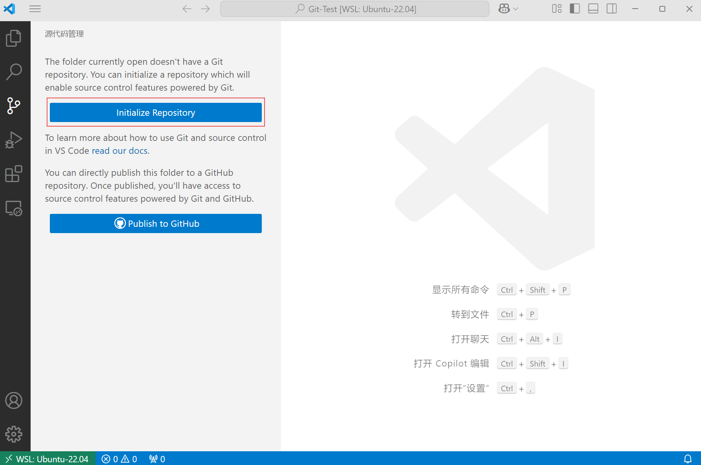

    3. 点击 'Initialize Repository'（这一步等同于 `git init`）。
    4. 新建 `main.cpp`，会出现 `U` 标记，意为 `Untracked（未跟踪的）`。

        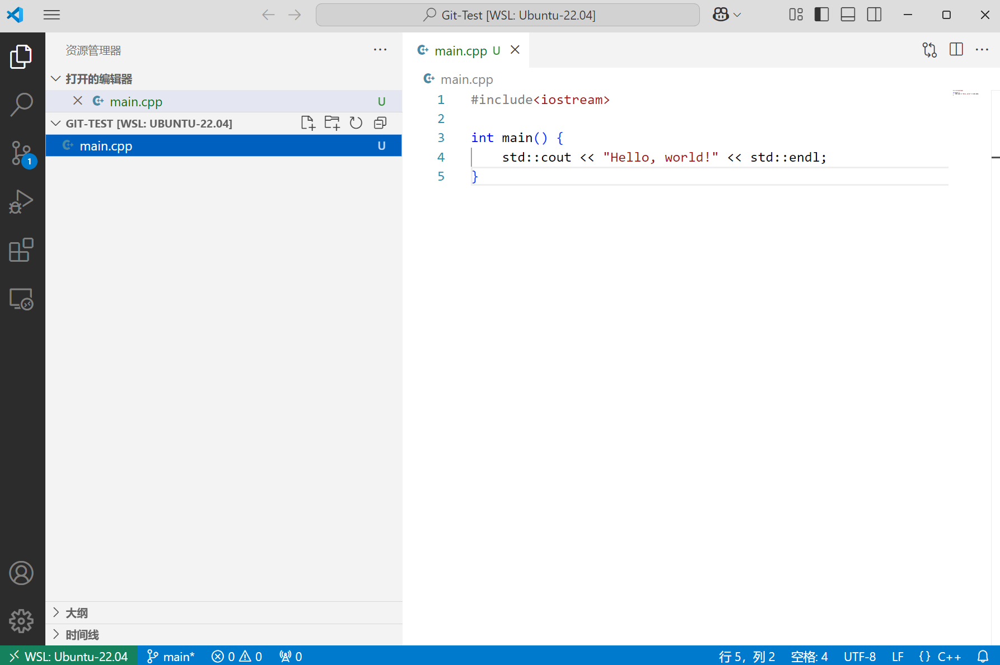

    5. 回到 `源代码管理` 界面，这里有两个 `+` 按钮。
    上方的 `+` 代表将项目中的所有更改添加到暂存区，相当于在项目目录下执行 `git add .`。
    下方的 `+` 代表将指定文件添加到暂存区，相当于执行 `git add main.cpp`。

        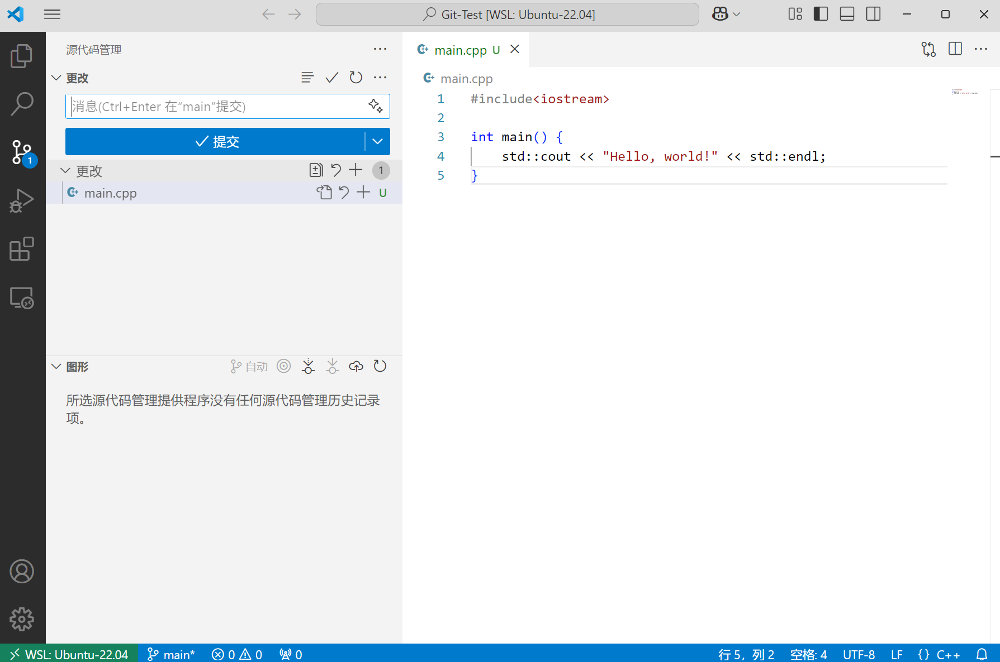

    6. 点击上方的 `+`，`main.cpp` 的标记变为 `A`，意为 `Added（已暂存）`。

        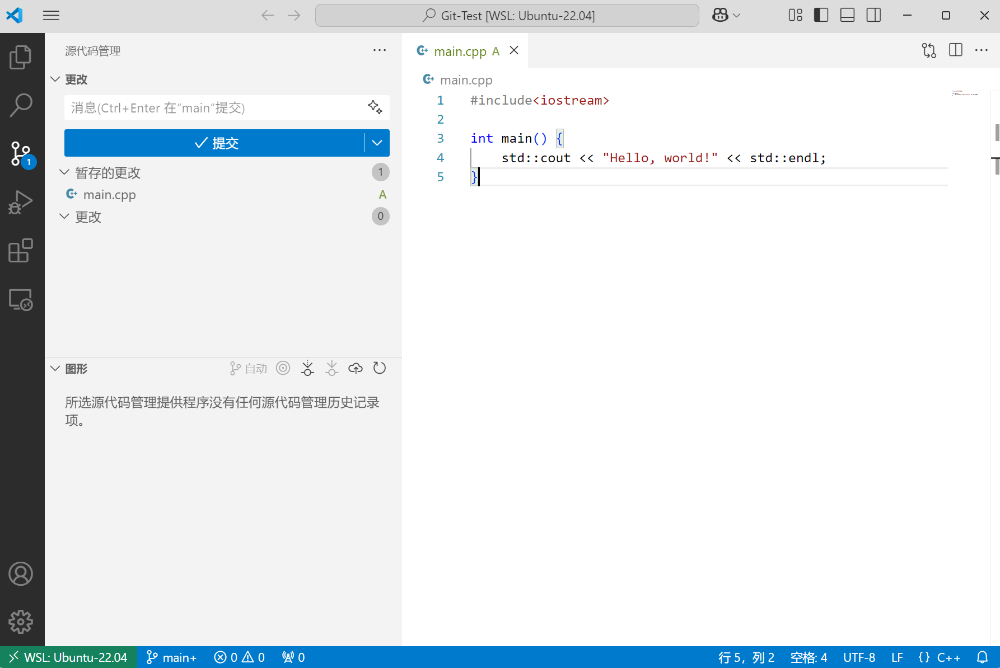

    7.  在文本框输入 commit message（可以是多行），点击提交，相当于执行 `git commit -m "Initial commit"`

        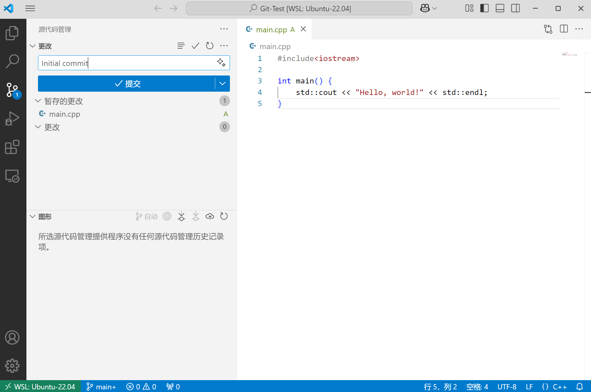

    8. 修改 `main.cpp`。这时 `main.cpp` 的标记会变为 `M`，意为 `Modified（已修改）`

        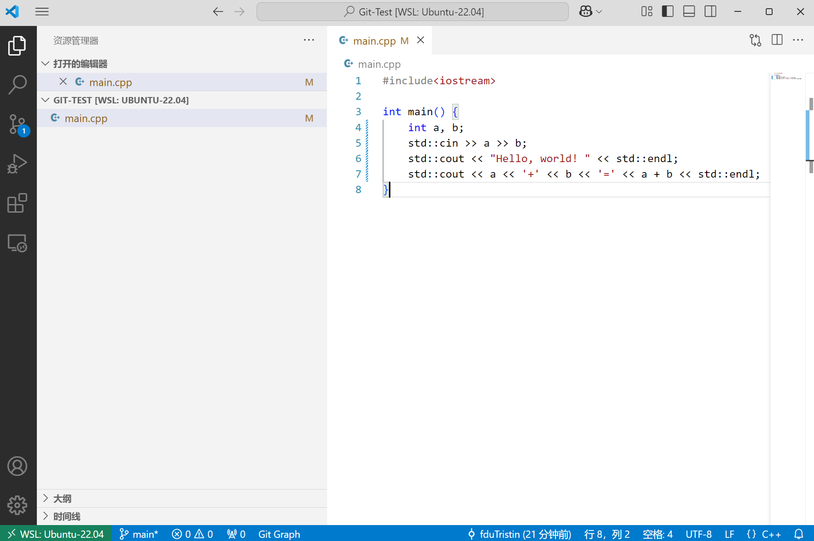

    9. 重复上述暂存、提交操作。

        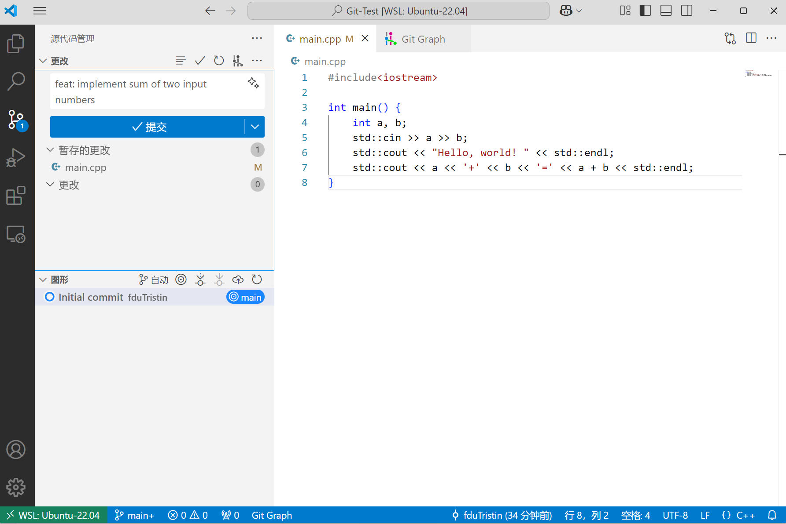

    10. 点击下方的 `Git Graph`，可以查看 Git 提交树。

        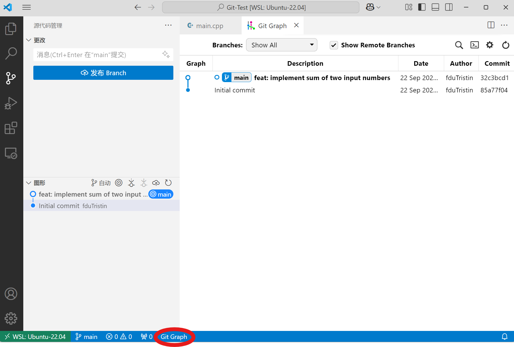
    
    11. 在 `图表` 页面悬停，可以查看每次提交的提交信息与作者，且可以复制提交哈希值。
        
        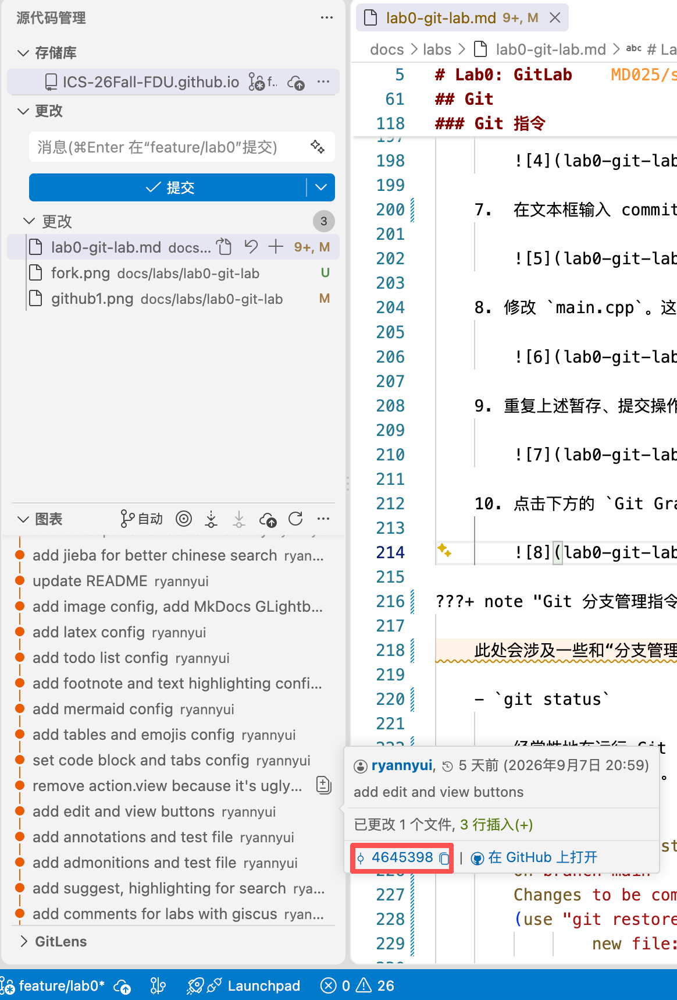
    
    12. 对于暂存区内不想要的更改，可以移动到暂存区内每个文件旁，点击 `-`，即可回退到未暂存的状态。
        
        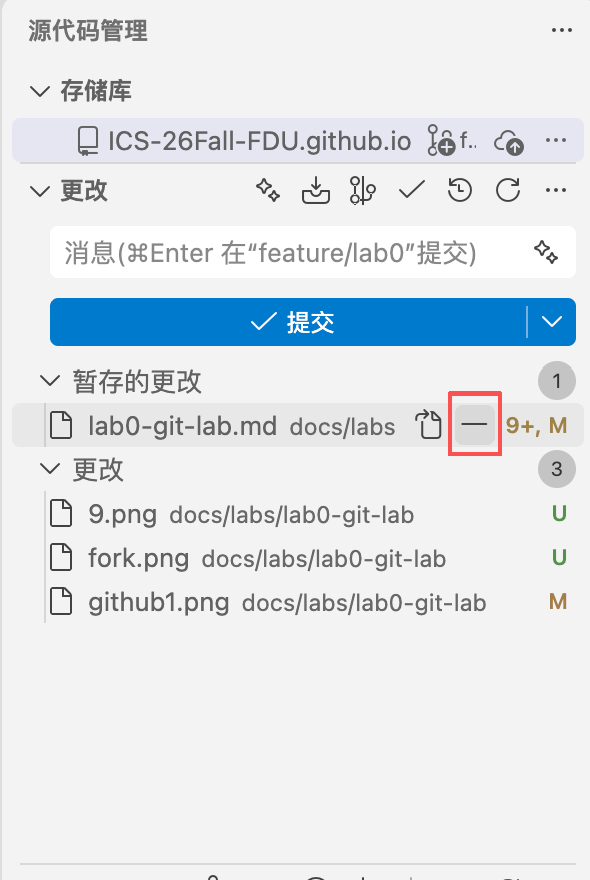

    13. 对于未暂存想要彻底放弃的更改，可以移动到暂存区内每个文件旁，点击放弃更改。此操作不可恢复。
        
        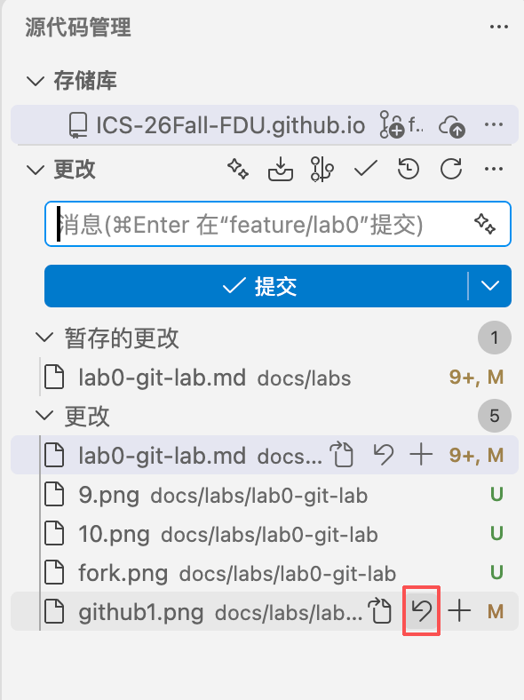
    

???+ note "可视化操作的背后：基本 Git 提交指令"

    这些命令是 Git 可视化操作的最初形态。

    - `git init`

        `git init` 将本地项目初始化为一个 Git 仓库。如果你打开项目文件夹，会发现多出了一个 `.git` 文件夹。

    - `git add` 与 `git restore`

        `git add` 将指定的改动添加到暂存区，例如：

        ```bash
        # 假设你处于 `/StudentGradeManagementSystem` 目录下

        # 将 src 目录下的 student.cpp 添加到暂存区
        git add src/student.cpp

        # 将当前目录下（及其递归子目录）的所有改动添加到暂存区
        git add .

        # 将整个仓库的所有改动添加到暂存区
        git add -A

        # 将当前目录下的所有后缀为 .cpp 的文件改动添加到暂存区（git add 支持字符串通配符）
        git add *.cpp
        ```

        暂存区内的改动可以用 `git restore` 随时回退。

        ```bash
        # 将当前目录下（及其递归子目录）暂存区的所有改动取消暂存
        git restore .

        # 将暂存区的单个改动回退取消暂存
        git restore src/student.cpp
        ```

    - `git commit`

        将暂存区的内容提交到本地仓库。

        `git commit` 一般有两种方式。

        1. `git commit -m "your commit message"` 直接在命令行写 commit message。
        2. `git commit` 执行后 Git 会打开默认编辑器，在这里可以写多行 commit message，适合对一次复杂的提交作详细描述。

        分支上的每一个 commit 都会被记录在本地的 `.git` 文件夹中并对应一个哈希值，因而随时可以恢复到过去的提交。
    
    !!! tip

        Git 为什么要设计“暂存-提交”两个步骤？在实验报告中谈谈自己的思考。

???+ note "Git 分支管理指令"

    此处会涉及一些和“分支管理”相关的 Git 操作，熟悉这些指令可以让你更好地管理你的代码分支。由于这些命令不便于日常可视化，使用时更多在终端操作。

    - `git status`

        经常性地在运行 Git 命令前运行 `git status` 是个好习惯，它可以告诉你，你当前在哪个分支下，有哪些修改还未被暂存，有哪些暂存区的文件还没被提交。

        ```bash
        user@linux:~/test-git$ git status
        On branch main
        Changes to be committed:
        (use "git restore --staged <file>..." to unstage)
                new file:   added-file

        Untracked files:
        (use "git add <file>..." to include in what will be committed)
                untracked-file
        ```

    - `git branch`

        可以使用 `git branch <branch-name>` 来从当前分支创建一个新的分支。注意，这不会将当前的代码分支切换到新创建的分支。

        例如，在 `main` 分支下运行 `git branch dev` 会创建一个 `dev` 分支（你可以使用 `git status` 查看！）。但是当前仍然会在 `main` 分支。

        !!! tip

            如果你想查看当前有哪些分支，可以使用 `git branch` 或者 `git branch -a`。查阅资料并在报告中回答，这两条命令的区别是什么？

        ```bash
        user@linux:~/test-git$ git branch dev
        user@linux:~/test-git$ git branch
        dev
        * main
        user@linux:~/test-git$ git branch -a
        dev
        * main
        ```

    - `git switch`

        可以使用 `git switch <branch-name>` 来切换到已经存在的分支。注意，你需要先提交你在当前分支上的所有文件，假如在当前分支上还有未 commit 的文件，那么这次 `git switch` 会失败。

        ```bash
        user@linux:~/test-git$ git switch dev
        Switched to branch 'dev'
        ```

        可以使用 `git switch -c <branch-name>` 从当前分支创建一个新的分支，并切换到这个分支。新分支会包含原分支的提交历史。

        ```bash
        user@linux:~/test-git$ git switch -c dev
        Switched to a new branch 'dev'
        ```

    - `git merge`

        `git merge` 用来把另一个分支的提交历史合并到当前分支。

        假设当前在 main 分支，你想合并 feature 分支：

        ```bash
        git checkout main
        git merge feature
        ```

        合并有两种常见的结果：

        1. Fast-forward 合并。如果 main 没有新的提交，只落后于 feature：

            ```bash
            main:    A---B
                        \
            feature:       C---D
            ```

            执行 `git merge feature` 后 `main` 分支会直接“快进”到 `D`。

            ```bash
            main:    A---B---C---D
                        \
            feature:       C---D
            ```

        2. 非 fast-forward 合并。如果两个分支各有提交：

            ```bash
            main:    A---B---E
                        \
            feature:       C---D
            ```

            执行 `git merge feature` 后 Git 会创建一个新的合并提交（merge commit）`F`：

            ```bash
            main:    A---B---E---F
                        \     /
            feature:       C---D
            ```

        !!! note

            当两个分支修改了同一文件的同一位置，就会出现冲突（conflict），Git 无法自动合并。

            ```bash
            user@linux:~/test-git$ git merge feature
            Auto-merging main.cpp
            CONFLICT (content): Merge conflict in main.cpp
            Automatic merge failed; fix conflicts and then commit the result.
            ```

            这时需要你手动修改文件处理冲突并提交。

??? example "另一些有趣的 Git 进阶指令"

    - `git commit --amend` 可以追加暂存的更改到上一次提交。
    - `git reset <commit-id>` 可以用于回退版本到指定提交，`git rebase` 可以用于合并几次提交并撰写新的提交信息。组合使用指令以整理当前分支的提交记录。
    - `git cherry-pick <commit-id>` 可以把任意提交追加到当前分支。此命令常用来从其他分支拿取想要的部分提交，也可以让最终提交的分支更干净。
    - `git log` 以 Vim 格式在终端浏览提交历史记录，用 `git log --pretty=oneline` 压缩行数。
    - `git checkout` 曾经是使用最频繁的 Git 分支管理指令。现在它的大部分功能已经被拆分到其他指令，如 `git branch`、 `git switch`、`git restore` 等等。

## GitHub

GitHub 是一个基于 Git 的代码托管平台，你可以将你的本地 Git 仓库上传为远程仓库，这样别人就可以拉取你的代码，与你进行协作。

### 配置

- 你需要注册一个 [GitHub](https://github.com/) 账户。

    !!! note

        注册 GitHub 的邮箱和你本地 `git config` 使用的邮箱最好一致，这样远程仓库的 commit 记录才能与你的 GitHub 账户对应上。当然，一个 GitHub 账户支持绑定多个邮箱，只要你 `git config` 中的邮箱包括在其中就没问题了。

- 在 GitHub 上配置 SSH 公钥

    1. 复制 `cat ~/.ssh/id_rsa.pub` 或 `cat ~/.ssh/id_ed25519.pub` 输出的结果（即公钥）。
    2. 打开 GitHub 并登录自己的账号。
    3. 点击右上角头像，进入 Settings ：

        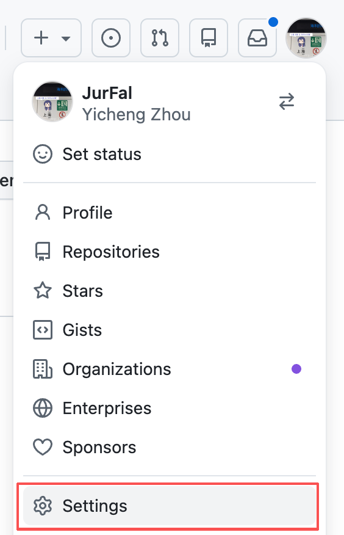

    4. 进入页面后，在左侧选择 `SSH and GPG keys`, 在右侧点击 `New SSH Key`。

        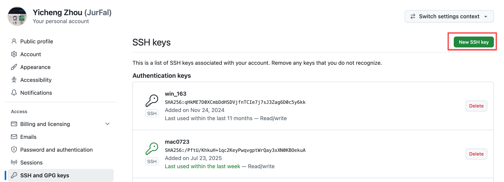

    5. 在框中粘贴入自己复制的公钥，点击 `Add SSH key` 即可。

        !!! note

            SSH key 的生成参考[这个文档](/misc/ssh)

            如果你在服务器上实验，需要在服务器上生成密钥对；如果在自己电脑的虚拟机上实验，需要在 WSL 中生成；如果你以后希望在本机拉取/上传 GitHub 仓库，则需要在本机生成密钥对。

    6. 验证配置是否成功

        ```bash
        user@linux:~$ ssh -T git@github.com
        Hi <用户名>! You've successfully authenticated, but GitHub does not provide shell access.
        ```

        如果没有得到期望的输出，请检查密钥对配置，如果仍有问题，请联系助教。

### Git Remote 基本操作

- `git clone`

    克隆远程仓库到本地。远程链接使用 HTTP 和 SSH 格式均可，其中 SSH 格式链接可通过 Watt Toolkit 加速。

    ```bash
    user@linux:~$ git clone <remote URL>
    ```

- `git pull`

    拉取最新的代码。这个操作相当于 `git fetch`（将远程分支拉到本地） + `git merge`（将远程分支合并入本地分支）

- `git push`

    将本地仓库的修改推送到远程仓库。

??? example "示例：修正课程网页的错误"

    如果你想修正我们课程网页上的错误，可以在 GitHub fork 我们的仓库，复制一份到你自己的仓库。
    
    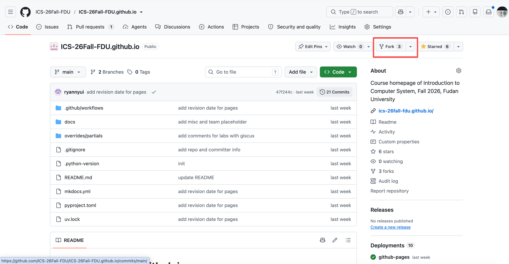
    
    然后点击 `Code`，再选择 `SSH`，复制这串 URL。

    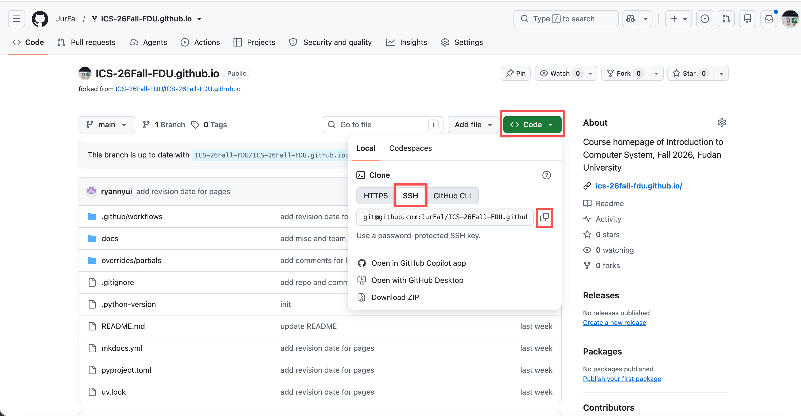

    在终端运行 `git clone git@github.com:ICS-26Fall-FDU/ICS-26Fall-FDU.github.io.git`（你需要替换成你自己仓库的地址）

    ```bash
    user@linux:~# git clone git@github.com:ICS-26Fall-FDU/ICS-26Fall-FDU.github.io.git
    正克隆到 'ICS-26Fall-FDU.github.io'...
    remote: Enumerating objects: 215, done.
    remote: Counting objects: 100% (215/215), done.
    remote: Compressing objects: 100% (112/112), done.
    remote: Total 215 (delta 94), reused 195 (delta 74), pack-reused 0 (from 0)
    接收对象中: 100% (215/215), 787.02 KiB | 66.00 KiB/s, 完成.
    处理 delta 中: 100% (94/94), 完成.
    ```

    下一个 lab 发布时，我们的网页仓库会有更新，需要运行 `git pull`

    ```bash
    user@linux:~/ICS-26Fall-FDU.github.io# git pull
    remote: Enumerating objects: 50, done.
    remote: Counting objects: 100% (50/50), done.
    remote: Compressing objects: 100% (12/12), done.
    remote: Total 29 (delta 13), reused 27 (delta 12), pack-reused 0 (from 0)
    展开对象中: 100% (29/29), 24.41 KiB | 328.00 KiB/s, 完成.
    来自 github.com:ICS-26Fall-FDU/ICS-26Fall-FDU.github.io
        47f244c..800df66  main       -> origin/main
        b4433a5..5d19f33  gh-pages   -> origin/gh-pages
    更新 47f244c..800df66
    Fast-forward
        docs/misc/ssh.md | 169 +++++++++++++++++++++++++++++++++++++++++++++++++++++++
        mkdocs.yml       |   3 +-
        2 files changed, 171 insertions(+), 1 deletion(-)
        create mode 100644 docs/misc/ssh.md
    ```

    如果你在自己的本地仓库提交了 commit，你就可以执行 `git push`，然后在 GitHub 上向我们的仓库发起 Pull Request，此部分可能会给你的实验提供附加分。

### 作业提交流程：使用模板仓库

本学期的作业需要大家在 GitHub 使用初始模板仓库建立自己的仓库，然后在自己的仓库中提交。以下为步骤：

  - 在我们给出的模板仓库链接中，点击 `Use this template` 后选择 `Create a new repository`。

  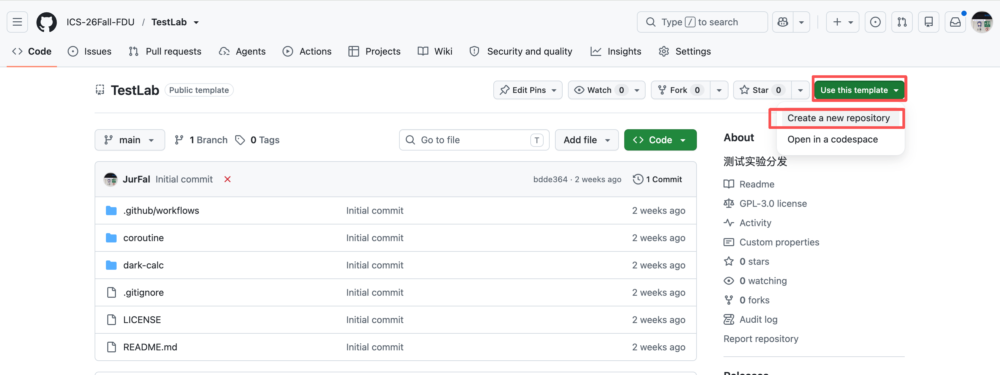

  - 随后的页面中，输入仓库名，然后点击 `Create repository`。

  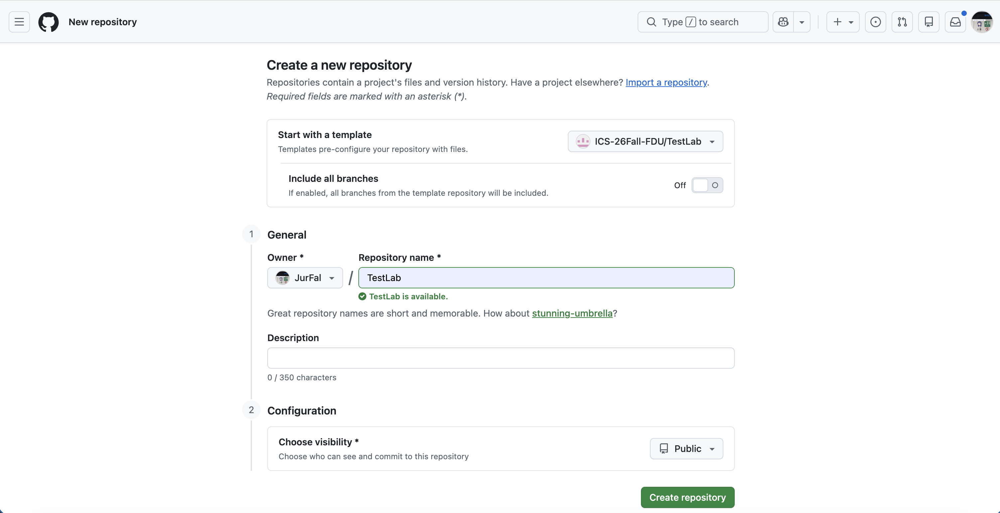

  - 接下来就可以用刚刚提到的克隆操作把仓库内容下载到本地了。
  - 完成实验后，在 E-Learning 提交你自己的仓库链接，如 `https://github.com/JurFal/TestLab` 。

## 实验任务

1. 认真阅读文档，学习 Git 的基本用法，并在报告中回答文档中的问题。（15 分）

    ??? tip "需要回答的问题"

        - 你之前有过多人协同开发的经历吗？如果有，你们是使用什么方式分工协作的？
        - 思考一下，Git 为什么要设计“暂存-提交”两个步骤？
        - `git branch` 和 `git branch -a` 的区别是什么？查阅资料并回答。

2. 使用我们的[模板仓库](https://github.com/ICS-26Fall-FDU/GitLab)建立个人仓库，完成 `main.c` 文件中的 `TODO` 部分并进行一次 commit。（50 分）

    !!! info

        只要填入任意字符串就算完成，当然你也可以随意发挥（程序的正确性不纳入计分，有修改即可）。

        如果你想要编译运行 `main.c`，执行

        ```bash
        make
        ./main
        make clean
        ```

3. 在下面的三个网页中任选其二进行阅读，简要概括其内容，并谈谈你对“为什么要学习 Git”这个问题的理解。（15 分）

    - [Commit Message 规范](https://www.ruanyifeng.com/blog/2016/01/commit_message_change_log.html)
    - [Git Flow 分支控制](https://www.dafaycoding.com/article/git-gif-flow)
    - [语义化版本](https://semver.org/lang/zh-CN/)

4. 学习 Git 分支管理，新建 `feature` 分支，在该分支以及 `main` 分支上对 `main.c` 分别进行一次修改与提交（10 分）。

    随后将 `feature` 分支 merge 到 `main` 分支（即切换回 main 分支执行 `git merge feature`），并处理发生的合并冲突（10 分）。

    !!! important

        在两个分支上的提交必须要满足：在 `main` 分支合并时会出现冲突。请你解决这个冲突，并在实验报告里截图表明你遇到并解决了冲突。

        请阅读 `git merge` 部分，思考如何修改 `main.c` 会出现冲突。

        如果你两次提交之后合并没有出现冲突，不必担心，你可以不用撤回之前的提交，而是继续尝试提交修改并 merge，直到出现冲突并解决。

5. 在 `main` 分支提交一份实验报告（实验报告单独评分），格式要求为 `PDF` 或 `Markdown`。内容包括：

    - 文档中要求回答的问题
    - 你的实验步骤
    - 必要的截图
    - 你的建议（可选）

    !!! note

        这里的“提交”是指在文件夹内添加一个 PDF 或 Markdown 文件，然后 `git add . && git commit`。

        如果你是 Word 爱好者，请你将它导出为 PDF。

        你可以在自己电脑上任一位置用 Word 写实验报告并导出，然后把 PDF 文件拖拽复制到 VSCode 编辑器左侧的目录下。

        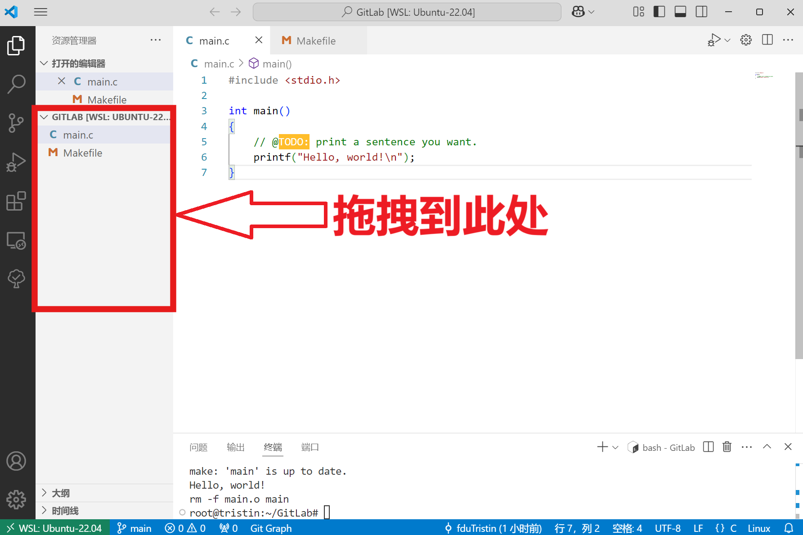

## 提交

提交方式：在本地仓库完成上述所有实验后，将资料和报告都上传到 main 分支，并提交到 GitHub。**在 E-Learning 平台上，提交你的个人仓库链接。**

截止时间：9 月 30 日 23:59。逾期将扣除部分分数。

!!! info "写在最后的话"

    作为第一次作业，这个文档的字数过多，但实际的任务很少。如果你对 Git 感兴趣可以认真读完，甚至在网上寻找其他学习资源。

    如果你觉得内容过于冗长，只需对照实验任务针对性地学习重点。完成后续其它 Lab 最简单的流程就是根据模板仓库建仓库 -> `git clone` -> 写完所有代码 -> `git add . && git commit -m "xxx" && git push` -> 在 E-Learning 提交你的仓库链接。

## 学习资源

- [Pro Git](https://git-scm.com/book/en/v2)  /  [Pro Git 中文版](https://git-scm.com/book/zh/v2)，推荐阅读1-3章
- [学习 Git 的在线游戏](https://learngitbranching.js.org/)，挺好玩的
- [ohshitgit](https://ohshitgit.com/)，简短的介绍了如何从 Git 错误中恢复
- [Git for Computer Scientists](https://eagain.net/articles/git-for-computer-scientists/)，简短的介绍了 Git 的数据模型
- [git-from-the-bottom-up](https://jwiegley.github.io/git-from-the-bottom-up/)，详细的介绍了 Git 的实现细节
- [explain-git-in-simple-words](https://xosh.org/explain-git-in-simple-words/)，如其名
- [用动图展示 10 大 Git 命令](https://zhuanlan.zhihu.com/p/132573100)，一篇精美文章

!!! info "本 Lab 负责助教"

    - [周弈成](mailto:yichengzhou23@m.fudan.edu.cn)

!!! info "特别鸣谢"

    - [徐厚泽](https://github.com/fduTristin)
    - [朱程炀](https://github.com/Zecyel)
