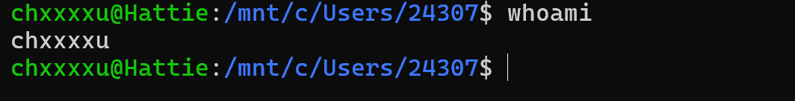
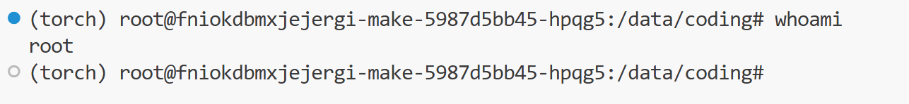

# Linux 用户、用户组与文件权限

在 Linux 中，命令总是以某个用户的身份执行。该用户及其所属的用户组，决定了它能读取或修改哪些文件，以及哪些操作需要管理员权限。

Linux 的权限机制让多位用户可以共用同一台计算机，同时避免普通程序任意修改系统文件。本页介绍日常使用中常见的用户、root、`sudo` 和文件权限问题。

## 我现在是谁，在哪里？

在终端中输入：

```bash
whoami
pwd
```

- `whoami` 显示当前执行命令的用户名；
- `pwd` 显示当前所在目录。

例如下图中，`whoami` 的输出为 `chxxxxu`，说明当前是普通用户。提示符末尾的 `$` 也是普通用户的常见标记；实际的主机名、路径和提示符样式会因环境而不同。



当前用户通常有自己的主目录，例如 `/home/alice`。以下三种写法都与主目录有关：

```bash
cd          # 回到自己的主目录
cd ~        # ~ 表示自己的主目录
echo $HOME  # 显示自己的主目录路径
```

个人文件通常应放在自己的主目录或项目工作目录中，而不应随意放入系统目录。

!!! info "WSL 中的一个常见困惑：`/mnt/c` 下的权限"

    在 WSL 中，`/mnt/c/...` 对应 Windows 的 C 盘，`/home/用户名/...` 则位于 Linux 文件系统中。前者的权限同时受 Windows 文件权限和 WSL 挂载方式影响，`chmod`、`chown` 的结果未必与原生 Linux 文件系统完全一致。

    因此，如果你在 `/mnt/c` 中修改权限后发现效果不符合预期，先确认文件所在位置；需要严格遵循 Linux 权限语义的项目，通常更适合放在 `/home/用户名/` 下。可参考 Microsoft 的 [WSL 文件权限说明](https://learn.microsoft.com/zh-cn/windows/wsl/file-permissions)。

## 普通用户、root 和 sudo

| 身份/命令 | 能做什么 | 常见场景 |
| --- | --- | --- |
| 普通用户 | 修改自己有权限访问的文件 | 编辑文件、编译程序、运行程序、管理个人项目 |
| `root` | 几乎可修改系统中的任何内容 | 系统管理员维护；不用于日常工作 |
| `sudo 命令` | 仅以管理员权限执行这一条命令 | 安装软件、修改系统配置 |

root 是系统管理员用户，提示符末尾通常为 `#`；下图中 `whoami` 的输出就是 `root`。不同系统可能在提示符前显示 Python 环境、主机名等额外信息。



`sudo` 的意思是“以管理员权限执行紧随其后的这一条命令”。例如在 Ubuntu 中安装软件时可能需要：

```bash
sudo apt update
sudo apt install build-essential gdb
```

输入 `sudo` 密码时，终端不会显示星号或字符，这是正常现象。

!!! warning "不要把 sudo 当作报错修复按钮"

    `sudo` 不会让错误的命令变正确，也不应被用于来源不明的命令。不要为了绕过权限错误而习惯性在项目目录中使用 `sudo gcc`、`sudo make`、`sudo git` 或 `sudo code .`。

## 用户组：一组用户共享同一类权限

用户组（group）是 Linux 权限管理中的另一层身份。文件除所有者外，还有一个所属组；同一组的用户可依据“组权限”共同访问文件。

查看自己属于哪些组：

```bash
id
groups
```

例如，若文件所有者是 `alice`、所属组是 `students`，而你的账户也属于 `students`，系统便会对你应用该文件的“组权限”。如果你既不是文件所有者，也不属于其所属组，系统才会使用“其他用户”的权限。

## 文件是谁的，谁能操作它？

使用 `ls -l` 查看当前目录中每个文件的所有者和权限：

```bash
ls -l
```

输出可能类似：

```text
-rw-r--r-- 1 alice students 1200 main.c
```

可以这样读：

```text
- rw- r-- r--  1 alice students 1200 main.c
│  │   │   │       │      │
│  │   │   │       │      └── 所属组
│  │   │   │       └───────── 文件所有者
│  │   │   └───────────────── 其他用户的权限
│  │   └───────────────────── 所属组用户的权限
│  └───────────────────────── 文件所有者的权限
└──────────────────────────── - 表示普通文件；d 表示目录
```

每一组权限中：

- `r`：可读（read）；
- `w`：可写（write）；
- `x`：可执行（execute）；
- `-`：没有该权限。

因此，`-rw-r--r--` 表示所有者可以读写 `main.c`，其他人只能读取它。

## 文件与目录的权限并不完全相同

对普通文件，`r`、`w`、`x` 通常可理解为读取内容、修改内容和作为程序执行。对目录，它们的含义略有不同：

| 权限 | 普通文件 | 目录 |
| --- | --- | --- |
| `r` | 读取文件内容 | 列出目录中的文件名 |
| `w` | 修改文件内容 | 在目录中创建、删除或重命名条目 |
| `x` | 执行文件 | 进入目录、访问其中已知名称的文件 |

因此，能看到目录名，并不代表能进入目录，也不代表能修改其中的文件。遇到目录访问问题时，除检查目标文件外，也要检查所在目录及其父目录的权限。

## 修改权限和归属

日常使用中常见的操作是为自己拥有的脚本补上执行权限：

```bash
chmod u+x script.sh
```

其中 `u` 表示文件所有者，`+x` 表示增加执行权限。修改前后可用 `ls -l script.sh` 确认。

也可以使用数字形式设定权限。每一位数字都是 `r=4`、`w=2`、`x=1` 的和：

```text
7 = rwx    6 = rw-    5 = r-x    4 = r--
```

例如：

```bash
chmod 644 notes.txt  # 所有者可读写；组和其他用户只读
chmod 755 script.sh  # 所有者可读写执行；其他用户可读和执行
```

若文件所有者错误，拥有管理员权限的用户可以用 `chown` 修改归属。例如，确认某个文件应归当前用户所有后：

```bash
sudo chown "$USER":"$USER" 文件名
```

!!! tip "优先使用最小权限变更"

    不要为了让报错消失就使用 `chmod 777`。它会让所有用户都拥有读、写和执行权限，通常既没有必要，也不安全。不确定时，`chmod u+x 文件名` 这类符号形式比数字形式更直观，也更不容易误改其他权限。

## 最常见的权限问题

### `Permission denied`

先不要立刻加 `sudo`，先执行：

```bash
whoami
id
pwd
ls -l 文件名
```

这几条命令分别显示当前用户、所属用户组、所在目录，以及文件的归属和权限。若文件属于自己，通常可按实际需要用 `chmod` 调整权限。

### 用过 sudo 以后，文件无法修改

例如在自己的项目目录中执行过 `sudo make`，生成的文件可能属于 root。此后普通用户再保存、删除或重新编译该文件时，就会遇到权限问题。

先确认所有者：

```bash
ls -l 文件名
```

确认这是自己的文件后，可将单个文件交还给当前用户：

```bash
sudo chown "$USER":"$USER" 文件名
```

不确定影响范围时，不要使用递归的 `chown` 或 `chmod`。若问题涉及整个目录，先记录 `pwd` 与 `ls -l` 的输出，再确认需要调整的范围。

### 明明文件存在，却无法进入目录或运行程序

目录缺少 `x` 权限时，可能无法 `cd` 进入；可执行文件缺少 `x` 权限时，可能无法运行。先检查：

```bash
ls -ld 目录名
ls -l 文件名
```

正常由 `gcc` 或 `g++` 生成的可执行文件通常已经带有 `x` 权限。如果确实没有，可使用 `chmod u+x 文件名`；若文件所有者不是自己，则应先查明它为什么由其他用户创建。

## 排查权限问题的简短清单

1. 先用 `whoami`、`id`、`pwd` 和 `ls -l` 了解现状。
2. 检查目标文件，以及它所在目录和父目录的权限。
3. 优先使用普通用户；只有确实需要系统权限时才使用 `sudo`。
4. 不执行不理解的管理员命令，也不要在不确定范围时递归修改权限或归属。

## 延伸阅读

- GNU Coreutils 对 [文件属性](https://www.gnu.org/software/coreutils/manual/html_node/Changing-file-attributes.html)、[`chmod` 的符号权限写法](https://www.gnu.org/software/coreutils/manual/html_node/Setting-Permissions.html) 与 [`chmod` 命令](https://www.gnu.org/software/coreutils/manual/html_node/chmod-invocation.html) 的说明。
- Linux 手册页：[`chmod(1)`](https://man7.org/linux/man-pages/man1/chmod.1.html) 和 [`chown(1)`](https://man7.org/linux/man-pages/man1/chown.1.html)。终端中也可运行 `man chmod` 或 `man chown` 阅读本机版本。
- 终端中可以通过 `man id`、`man groups` 和 `man ls` 查阅本文中身份、用户组和文件列表命令的本机手册。
- 如果普通的所有者、组和其他用户三组权限仍不能满足需求，可继续了解 [ACL（访问控制列表）](https://man7.org/linux/man-pages/man5/acl.5.html)。
